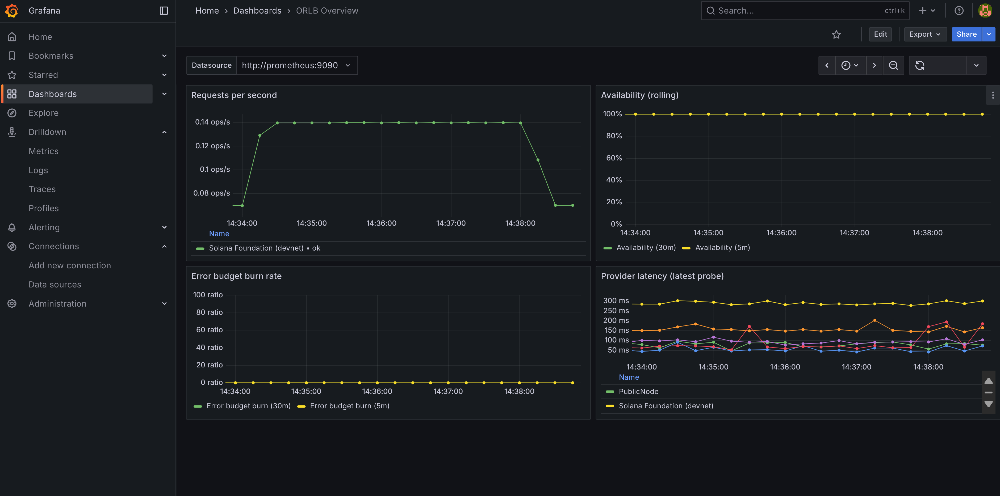

# Open RPC Load Balancer (ORLB)

<p align="center">
  
</p>

ORLB is a lightweight JSON-RPC proxy for Solana that fans client traffic across multiple upstream RPC providers. It continuously probes each provider, scores them on latency and error rate, retries idempotent calls once, and exposes live Prometheus metrics plus a web dashboard. The goal of this MVP is to prove dependable routing with public RPCs in a single-container deploy.

## Core Capabilities
- **Smart routing** - weighted round-robin informed by latency EMA and failure streaks.
- **Read-only safety** - mutating RPC methods like `sendTransaction` are blocked.
- **Automatic retries** - read-only calls try a second provider on timeouts/429/5xx.
- **Health probes** - background `getSlot` checks every 5s update provider status.
- **Quarantine & backoff** - providers with sustained failures are sidelined with exponential cooldown until probes succeed.
- **Freshness scoring** - slot-aware penalties keep traffic on the highest-commitment providers.
- **Commitment-aware routing** - inspects JSON-RPC commitment hints and prefers providers whose slot height satisfies processed/confirmed/finalized requirements.
- **Tier-aware weighting** - tag providers (paid/public/foundation, etc.) and boost or de-prioritise traffic with configurable multipliers.
- **Adaptive hedging** - optional parallel requests race a backup provider when the primary stalls.
- **Observability** - `/metrics` (Prometheus text) and `/metrics.json` plus `/dashboard` (Chart.js) showing live scores.
- **Doctor CLI** - `orlb doctor` lints the registry, validates headers, and probes each upstream before you deploy.
- **Simple ops** - single binary with embedded dashboard, configurable via env vars, ships with Dockerfile and CI.

## Project Layout
```
src/
  main.rs              bootstrap (config, tracing, background tasks)
  config.rs            env parsing with defaults
  registry.rs          provider registry loader (`providers.json`)
  metrics.rs           Prometheus collectors + dashboard snapshot logic
  forward.rs           reqwest client builder and JSON-RPC forwarding
  health.rs            async probe loop updating provider health
  router.rs            Hyper HTTP server, routing, retry logic, tests
  dashboard.rs         serves embedded Chart.js dashboard
static/dashboard.html   HTML/JS UI (pulls `/metrics.json` every 5s)
providers.json          sample provider pool
Dockerfile              multi-stage build producing minimal image
```

## Getting Started
### Prerequisites
- Rust 1.82+ (`rustup toolchain install 1.82.0`)
- `cargo` and `rustfmt` (`rustup component add rustfmt clippy`)

### Run Locally
```bash
cargo run
# ORLB listens on 0.0.0.0:8080 by default
```

Send a request:
```bash
curl http://localhost:8080/rpc \
  -H 'content-type: application/json' \
  -d '{"jsonrpc":"2.0","id":1,"method":"getSlot","params":[]}'
```

View the dashboard at [http://localhost:8080/dashboard](http://localhost:8080/dashboard). Prometheus can scrape [http://localhost:8080/metrics](http://localhost:8080/metrics).

### Configuration
ORLB is configured via environment variables and a provider registry file:

| Variable | Default | Description |
|---|---|---|
| `ORLB_LISTEN_ADDR` | `0.0.0.0:8080` | HTTP listen address |
| `ORLB_PROVIDERS_PATH` | `providers.json` | Path to JSON provider registry |
| `ORLB_PROBE_INTERVAL_SECS` | `5` | Health probe interval |
| `ORLB_REQUEST_TIMEOUT_SECS` | `10` | Upstream request timeout |
| `ORLB_RETRY_READ_REQUESTS` | `true` | Retry read-only calls once on failure |
| `ORLB_DASHBOARD_DIR` | unset | Optional override directory for dashboard HTML |
| `ORLB_SLOT_LAG_PENALTY_MS` | `5` | Weighted-score penalty (ms) applied per slot behind the freshest provider |
| `ORLB_SLOT_LAG_ALERT_SLOTS` | `50` | `orlb doctor` warns when a provider lags this many slots |
| `ORLB_HEDGE_REQUESTS` | `false` | Launch a hedged request when the primary read call stalls |
| `ORLB_HEDGE_DELAY_MS` | `60` | Base delay (ms) before the hedged provider is attempted |
| `ORLB_ADAPTIVE_HEDGING` | `true` | Enable adaptive hedging that adjusts delay based on provider latency |
| `ORLB_HEDGE_MIN_DELAY_MS` | `10` | Minimum hedge delay (ms) for adaptive mode |
| `ORLB_HEDGE_MAX_DELAY_MS` | `200` | Maximum hedge delay (ms) for adaptive mode |
| `ORLB_SLO_TARGET` | `0.995` | Availability target used for rolling SLO burn-rate calculations |
| `ORLB_OTEL_EXPORTER` | `none` | OpenTelemetry exporter (`none`, `stdout`, or `otlp_http`) |
| `ORLB_OTEL_ENDPOINT` | unset | OTLP endpoint when `ORLB_OTEL_EXPORTER=otlp_http` (e.g. `http://collector:4318`) |
| `ORLB_OTEL_SERVICE_NAME` | `orlb` | Service name attribute attached to emitted spans |
| `ORLB_TAG_WEIGHTS` | unset | Optional comma-separated multipliers per tag (e.g. `paid=2.0,public=0.6`) |

`providers.json` format:
```json
[
  {"name": "Solana Foundation", "url": "https://api.mainnet-beta.solana.com", "weight": 1, "tags": ["foundation", "paid"]},
  {"name": "PublicNode", "url": "https://solana-rpc.publicnode.com", "weight": 1, "tags": ["public"]},
  {"name": "Alchemy (demo)", "url": "https://solana-mainnet.g.alchemy.com/v2/demo", "weight": 1, "tags": ["paid"]},
  {"name": "QuikNode (docs demo)", "url": "https://docs-demo.solana-mainnet.quiknode.pro", "weight": 1, "tags": ["paid"]},
  {"name": "SolanaTracker", "url": "https://rpc.solanatracker.io/public", "weight": 1, "tags": ["public"]}
]
```
Optional headers per provider can be supplied with a `headers` array (`[{ "name": "...", "value": "..." }]`). Tune `weight` and `tags` to bias traffic toward trusted paid tiers while still keeping resilient public RPC coverage.

### Provider tagging & policies
- Add a `tags` array to any provider in `providers.json` (tags are normalised to lowercase and duplicates removed).
- Set `ORLB_TAG_WEIGHTS` to boost or damp traffic per tag. Example: `ORLB_TAG_WEIGHTS=paid=2.0,public=0.6` doubles effective weight for tagged paid providers and trims public ones to 60%. When a provider has multiple matching tags, the highest multiplier wins.
- Effective weights (base × multiplier) surface in `metrics.json` (`effective_weight`, `tag_multiplier`) and on the dashboard so you can audit routing decisions.

### Diagnostics
Run `cargo run -- doctor` (or the compiled binary with `orlb doctor`) to lint the provider registry and perform live reachability probes. The command flags duplicate names/URLs, invalid headers, zero weights, stale commitment (providers lagging more than `ORLB_SLOT_LAG_ALERT_SLOTS` slots), and transport/HTTP failures. A non-zero exit status indicates issues that should be fixed before deploying.

### Hedged Requests
Enable `ORLB_HEDGE_REQUESTS=true` to let ORLB fire a backup provider when the primary read stalls. The primary is dispatched immediately; if the call is still in flight after `ORLB_HEDGE_DELAY_MS`, a second provider is raced and the fastest success wins while the slower request is cancelled. Hedging only applies to retryable read methods, respects the global retry limit, and surfaces activity through the `orlb_hedges_total{reason}` Prometheus counter.

**Adaptive Hedging** (default: enabled) automatically adjusts the hedge delay based on each provider's recent latency characteristics to reduce p99 latency:
- **Slow providers**: Hedge earlier (shorter delay) to prevent long stalls
- **Fast providers**: Use normal or slightly longer delays to avoid unnecessary parallel requests
- **Failing providers**: Hedge very early (50% of calculated delay) when recent failures are detected
- Adaptive delays are clamped between `ORLB_HEDGE_MIN_DELAY_MS` and `ORLB_HEDGE_MAX_DELAY_MS`
- Set `ORLB_ADAPTIVE_HEDGING=false` to use fixed delays for all providers


### HTTP Endpoints
- `POST /rpc`   JSON-RPC forwarding (read-only enforced, retries once on retryable failures).
- `GET /metrics`   Prometheus text format metrics (`orlb_requests_total`, `orlb_provider_latency_ms`, etc.), auto-refreshing every 5 seconds in a browser tab.
- `GET /metrics.json`   JSON snapshot powering the dashboard.
- `GET /dashboard`   live Chart.js UI summarising provider health.

### Metrics Highlights
- `orlb_requests_total{provider,method,status}`   counts per upstream and outcome.
- `orlb_request_failures_total{provider,reason}`   upstream failures grouped by reason.
- `orlb_retries_total{reason}`   retry invocations (transport/timeouts/status codes).
- `orlb_hedges_total{reason}`   hedged request launches grouped by trigger (`adaptive`, `timer`, `status`, etc.).
- `orlb_provider_latency_ms{provider}`   latest latency measurement.
- `orlb_provider_health{provider}`   `1` healthy, `0` degraded.
- `orlb_provider_slot{provider,commitment}`   most recent slot observed for processed/confirmed/finalized commitments.
- `orlb_slo_availability_ratio{window}`   rolling availability for predefined SLO windows (`5m`, `30m`, `2h`).
- `orlb_slo_error_budget_burn{window}`   error-budget burn rate normalised against `ORLB_SLO_TARGET`.
- `orlb_slo_window_requests{window}` / `orlb_slo_window_errors{window}`   sample sizes that back the SLO gauges.

### Observability
- **Tracing** - enable OpenTelemetry spans by setting `ORLB_OTEL_EXPORTER` to `stdout` (local debugging) or `otlp_http` plus `ORLB_OTEL_ENDPOINT` for collectors such as the upstream OTEL Collector. `ORLB_OTEL_SERVICE_NAME` customises the emitted `service.name` resource.
- **Service-level objectives** - the SLO gauges exposed at `/metrics` track 5-minute, 30-minute, and 2-hour availability windows and their burn rates against `ORLB_SLO_TARGET` (default 99.5%). These gauges back intuitive alert rules and time series panels.
- **Per-provider SLOs** - `orlb_provider_slo_availability_ratio{provider,window}` and `orlb_provider_slo_error_ratio{provider,window}` expose rolling availability and error shares for each upstream, feeding the Grafana panels.
- **Commitment tracking** - provider snapshots and metrics highlight slot lag per processed/confirmed/finalized commitment so you can spot stale endpoints quickly.
- **Dashboards & alerts** - import `ops/grafana/dashboards/orlb-dashboard.json` into Grafana and point it at your Prometheus datasource to get request rate, SLO, and provider latency visualisations. `ops/alerts/orlb-alerts.yaml` ships multi-window burn-rate and availability alerts so you can page on fast/slow budget burn as well as long-term SLO dips.
- **Quick checks** - `/metrics` now includes a `Refresh: 5` header so you can leave it open in a browser and watch gauges update in real time.


_Grafana dashboard showing live request rates, error-budget burn, and provider latency once Prometheus is scraping ORLB._
## Testing
Unit-style tests live alongside the router and cover forwarding success, retry failover, and write-method rejection. Run the full suite with:
```bash
cargo fmt --all
cargo clippy --all-targets --all-features -- -D warnings
cargo test
```
Continuous integration in `.github/workflows/ci.yml` enforces the same checks.
Run `bash scripts/smoke.sh` against a running instance to verify `/metrics` responds and Prometheus reports the `orlb` target as healthy.

## Docker
### Single-container quick start
```bash
docker build -t orlb .
docker run --rm -p 8080:8080 \
  -v $(pwd)/providers.json:/app/providers.json \
  -e ORLB_PROVIDERS_PATH=/app/providers.json \
  orlb
```

The runtime image is based on `debian:bookworm-slim`, bundles the compiled binary plus static assets, and installs CA certificates for TLS connections.

### Full observability stack (Docker Compose)
`docker-compose.yml` wires ORLB together with Prometheus, Alertmanager, and Grafana:
```bash
docker compose up --build
```
This stack:
- builds the ORLB image locally and mounts `providers.json` for live edits.
- loads Prometheus with `prometheus.yml`, automatically including alert rules from `ops/alerts/` and forwarding them to Alertmanager (`ops/alertmanager/alertmanager.yml`).
- provisions Grafana with the Prometheus datasource and imports `ops/grafana/dashboards/orlb-dashboard.json` so the overview dashboard is ready immediately (default login `admin` / `admin`).

Prometheus scrapes ORLB at `orlb:8080` inside the Compose network. If you run Prometheus outside of Compose, update `prometheus.yml` to target `localhost:8080` (or your host IP) and point Grafana at the correct Prometheus URL.
If Alertmanager is not part of your deployment, remove or adjust the `alertmanagers` block in `prometheus.yml`.
If you already have standalone containers named `prometheus`, `grafana`, or `alertmanager`, stop or remove them (`docker compose down` or `docker rm -f <name>`) before launching the stack to avoid name collisions.
Run `bash scripts/stack-info.sh` (or `.\scripts\stack-info.ps1` on PowerShell) any time to print clickable URLs for the running services.
When the stack is up on your local machine, the default entry points are:
- [ORLB metrics](http://localhost:8080/metrics)
- [Prometheus UI](http://localhost:9090/)
- [Alertmanager UI](http://localhost:9093/)
- [Grafana UI](http://localhost:3000/) (login `admin` / `admin` by default)

## Deploying to Fly.io (Example)
1. Create `fly.toml` (simplified):
   ```toml
   app = "orlb-mvp"

   [http_service]
   internal_port = 8080
   force_https = true
   auto_stop_machines = true
   auto_start_machines = true
   ```
2. `fly auth login`
3. `fly launch --no-deploy`
4. `fly deploy`

Set secrets for any private provider headers or API keys. The service is stateless so horizontal scaling is straightforward (just keep `providers.json` consistent across instances).

## Roadmap Ideas
- ~~Commitment-aware routing (processed/confirmed/finalized scoring).~~ ✅
- Subscription/WebSocket fan-out.
- API key rate limiting and auth.
- Edge deployments across regions, optional caching (e.g., `getLatestBlockhash`).
- ~~Adaptive parallelism/hedging to shave p99 latency when a provider stalls.~~ ✅
- ~~Provider tagging/policies to express traffic weights by tier (paid vs public pools).~~ ✅
- ~~SLO-aware alerting that turns Prometheus metrics into burn-rate signals.~~ ✅
- Optional secret-manager (Vault/GCP/AWS) integration for provider API keys.

## License
Apache 2.0 (or adapt as needed). Feel free to fork and extend for demos or production load-balancing.


